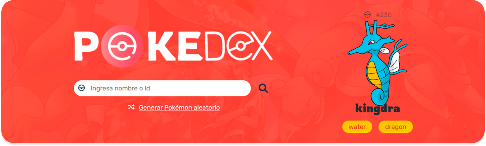
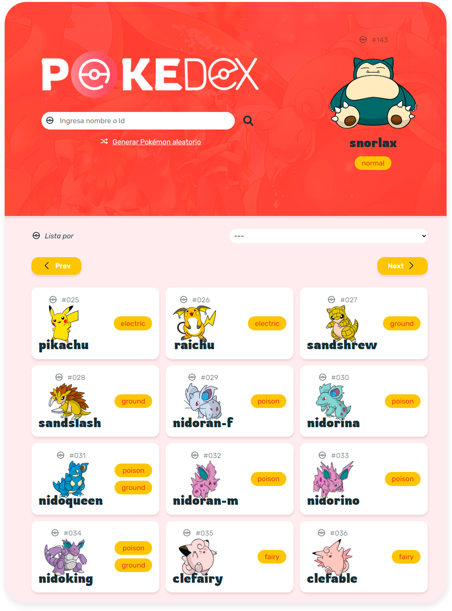

<h1 align="center">POKEDEX UI | Template</h1>



La UI se diseñará de forma artesanal, así es, solo HTML y CSS. Es decir, cero frameworks css, todo desde cero. Después daremos vida a cada componente, que sirva de comunicación entre la interfaz y la API, con Vanilla JS y así obtener toda esa data que nutrirá de contenido a esta hermosa Landing Page Responsive.

🧡Si te interesa aprender a estructurar de forma good el HTML de tus proyectos web:
- Usando HTML Semántico
- Componentes HTML con BEM

💙El maquetado CSS de forma good:
- Implementado normalize
- Estilo bases
- Custom propertys
- Cascada
- Herencia
- Componentes CSS usando BEM

Y otras cosas muy nice de HTML Y CSS, **Te veo en ❤️Tikokt** pero si solo te interesa la parte de las peticiones con **💛Vanilla JS**, simpleamente **descargate el 🧰 proyecto** que ya estara listo para que empieces tirar código como, si no, hubiera un mañana.

⚜️ El proyecto final se vera así:



## 🗃️ CÓMO DESCARGAR EL PRÓYECTO

Hay **tres formas**, la primera es clonando el repositorio a tu máquina local y es la que más vas usar en proyectos reales como web developer.

Antes de hacer un `git clone` te recomiendo que leas las tres formas de descarga una copia del proyecto.

### 1. Clonando el repositorio

Lo primero que debes de hacer es ir al repositorio del proyecto llamado [pokedex-ui-template](https://github.com/richirrim/pokedex-ui-template) y copiar en enlace del proyecto.

Ahora abre un terminal en la ubicación donde guardes todos tus proyectos web y tipea el sig. comando: `git clone https://github.com/richirrim/pokedex-ui-template`.

<!--  Aquí va ir un gif -->

Y listo tendrás una copia de este proyecto en tu máquina local. Ahora, sin miedo al éxito, puedes empezar a modificarlo a tu gusto.


### 2. Haciendo Fork y clonando el repositorio
Ahora, si eres un developer good, lo ideal seria que hicieras un Fork del proyecto y luego hicieras un git clone a ese Fork.

<!--  Aquí va ir un gif -->
### 3. Descargando el proyecto en un archivo ZIP
Ojito, los comando anteriores solo los puedes utilizar  si tienes una cuenta en Github, Git instalado y configurado en tu PC. Ahora, si aún no estás usando Git, es buen momento para decirte que es una herramienta que se va a volver tu pan de cada día como Web Developer. Aparte es una skill muy solicitada por las empresas y que aporta un gran valor a tu perfil profesional. 

Pero para no hacer mucho lío, te puedes descargar el proyecto sin necesidad de tener instalado Git o tener una cuenta en Github.

Solo sigue lo sig. pasos y podrás descargar todo el proyecto en formato ZIP.

<!--  Aquí va ir un gif -->

## ⚙️ HERRAMIENTAS QUE USAREMOS EN ESTE PROYECTO

- [VScode](https://code.visualstudio.com/), pero eres libre de elegir el editor con el que te sienta más comod@.
- [BrowserSync | Extensión for VSCode](https://marketplace.visualstudio.com/items?itemName=jasonlhy.vscode-browser-sync) para refrescar el navegador automáticamente.

Y ya, es todo c:

## ⛩️ Estructura del proyecto

Sera una estructura muy básica pero organizada.

- **📂 css**: Contiene los estilos del proyecto y el reset para normalizar el css en todos los navegadores y así lograr que nuestro proyecto siempre se vea igual en cualquier navegador.
  - **📄 normalize.css**: Normaliza los estilos en todos los navegadores.
  - **📄 style.css**:  Nuestros estilos.
- **📂 images**: Contiene todas las imágenes del proyecto como logos, banners, etc.
  - **📂 icons**: Aquí encontrarás todos los iconos para este proyecto y también los favicon.  
  - *📂 README*: Esta carpeta ignórala, la uso para guardar imágenes que sirven para documentar el proyecto.
- **📂 js**: Contiene código JavaScript y es donde haremos las peticiones a la API.
  - **📄 script.js**
- **📄 Index.html**: Contiene la estructura HTML de nuestra Landing Page.
- **📄 README**: Contiene la documentación que estás leyendo.

## ⚙️ API
La [PokeApi](https://pokeapi.co/) es una **API consumption-only**, es decir, solo nos permitirá hacer  consultas de tipo `GET`. Y no requiere ningún tipo de autenticación para acceder a toda la  información good.

Esta API te permitirá consultar la siguiente información:

- Permite hacer paginación, por defecto, con un **límite de 20 Pokémon por página**.
- Permite consultar un Pokémon específico con un **ID o nombre**.
- Permite consultar una **lista** con todos los **tipos** que existen en Pokémon.
- Permite consultar una lista de Pokémon **por tipo**.
- Entre muchas cosas más.

Ojo👀: Todo los devuelto por esta API siempre seran en formato JSON.

## 🚀 API ENDPOINTS

Acontinuación te dejo la lista de endpoint que se prendenden implementar en este proyecto🐇.

### Pagination (endpoint)
**`GET`** https://pokeapi.co/api/v2/pokemon

Hacer una petición aun endpoint como este sin ningun parametro extra como un ID o nombre de Pokemon, devolvera una sola página, por defecto, con 20 elementos. Es decir, una lista con un limte de 20 Pokemon.

Este endpoint aparte de traer la lista de 20 Pokemon dentro del atributo `results: [] 20 items`, también devuelve la info. que nos permitira crear la páginación (`next` y `previous`) de nuestro proyecto.

```json
{
  "count": 1126,
  "next": "https://pokeapi.co/api/v2/ability/?limit=20&offset=20",
  "previous": null,
  "results": [
    {
      "name": "bulbasaur",
      "url": "https://pokeapi.co/api/v2/pokemon/1/",
    },
    {
      "name": "ivysaur",
      "url": "https://pokeapi.co/api/v2/pokemon/2/",
    },
    {
      "name": "venusaur",
      "url": "https://pokeapi.co/api/v2/pokemon/3/"
    }
  ]
}
```

**Obviamente la API te va devolver más de tres Pokemon, yo lo hago así a modo de ejemplo.**

### Pokemon (endpoint)
**`GET`** pokeapi.example/api/v2/pokemon/**{id o name}**

Hacer una petición de este estilo y pasarle como paremetro un ID (número) o el nombre del Pokemon devolvera data sobre un Pokemon especifico.

**Exmaple**: Consulta 
- Por nombre: https://pokeapi.co/api/v2/pokemon/pikachu
- Por ID https://pokeapi.co/api/v2/pokemon/25

```json
{
  "abilities": [],
  "base_experience": 112,
  "forms": [],
  "game_indices": [],
  "height": 4,
  "held_items": [],
  "id": 25,
  "is_default": true,
  "location_area_encounters": "https://pokeapi.co/api/v2/pokemon/25/encounters",
  "moves": [],
  "name": "pikachu",
  "order": 35,
  "past_types": [],
  "species": {},
  "sprites": {},
  "stats": [],
  "types": [],
  "weight": 60
}
```
**Obviamente la API te va devolver más información, yo lo hago así a modo de ejemplo.**
### Type (endpoint)

**`GET`** pokeapi.co/api/v2/type

Hacer una petición de este estilo sin parametros adicionales devolvera una lista de tipos de Pokemon, es decir, comenzando con los de tipo normal y terminando con los de tipo shadow. 

Adicionalmente la respuesta de este enpoint ademas de proporcionarnos el nombre del tipo, proporcionara una URL para consultar los Pokemon por su tipo.

```json
{
  "count": 20,
  "next": null,
  "previous": null,
  "results": [
    {
      name: "normal",
      url: "https://pokeapi.co/api/v2/type/1/"
    },
    {
      name: "fighting",
      url: "https://pokeapi.co/api/v2/type/2/"
    },
    {
      "name": "flying",
      "url": "https://pokeapi.co/api/v2/type/3/"
    }
  ]
}
```
**Obviamente la API te va devolver más de tres tipos de Pokemon, yo lo hago así a modo de ejemplo.**


**`GET`** pokeapi.example/api/v2/type/**{ID o nombre}**

Hacer una petición de este estilo con un parametro devolvera data sobre un Pokemon dependiendo del tipo.

**Example**: Consulta
- Por ID: https://pokeapi.co/api/v2/type/8
- Por nombre: https://pokeapi.co/api/v2/type/ghost

```json
{
  "damage_relations": {},
  "game_indices": [],
  "generations": {},
  "id": 8,
  "move_damage_class": {},
  "moves": [],
  "name": "ghost",
  "mames": [],
  "past_damage_relations": [],
  "pokemon": []
}
```
**Obviamente la API te va devolver más información, yo lo hago así a modo de ejemplo.**

<h2 align="center">MAY THE DEMO EFFECT BE WITH YOU</h2>
Si encontraste algo útil en este 🚀proyecto y te aporto valor, 🔗compártelo con todo los 👤terricolas del planeta🌎tierra. Y no olvides seguirme en instagram para más contenido good.